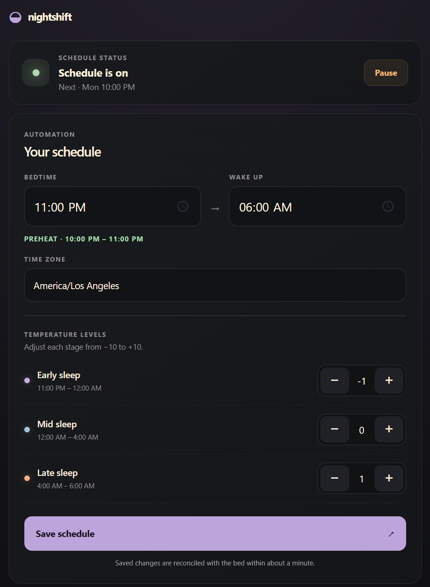

# Nightshift

A WebApp that allows users to schedule an Eight Sleep Pod without an Eight Sleep subscription.

Each user chooses a bedtime, wake time, time zone, and early, middle, and late levels. The app derives the phase times and starts preheat up to one hour before bedtime. Physical or Eight Sleep app adjustments during sleep are respected until wake; daytime adjustments persist until the next preheat. The UI shows recent scheduler checks, observed bed settings, and commands. These observations come from scheduled runs; the app does not poll the bed.

This runs on Cloudflare's free tier. Cloudflare Access identifies each user. One SQLite-backed Durable Object stores both users' settings and encrypted Eight Sleep tokens, and its alarm wakes at the next schedule change. The Worker serves the UI and API from this repository.

## Develop

Use Node 24 or later. Run `npm ci`, `npm test`, and `npm run typecheck` from the repository root. For local development, create `.dev.vars` with a **development-only** 64-character hex `TOKEN_KEY` (for example, `openssl rand -hex 32`), then run `npm run dev` and open `http://localhost:8787`. Wrangler supplies the local Access identity `local@example.invalid`. The dev script forces `CONTROL_ENABLED=false`, so local alarms do not control the bed.

Wrangler stores local Durable Object data in `.wrangler/`. Both `.dev.vars` and `.wrangler/` are ignored by Git.

## Public demo

Run `npm run build:demo` to generate `dist-demo/` from the shared `ui/` files. The output contains only static files. Its demo mode shows the unconnected interface, lets visitors explore the schedule controls locally, and disables saving and account connection. It makes no API requests, includes no account data, and has a static Content Security Policy that blocks network connections and form submissions. The generated directory is ignored by Git.

To publish at `sleep-demo.danong.dev`, create a separate **Cloudflare Pages** project connected to this Git repository. Choose no framework preset, the repository root as the root directory, `npm run build:demo` as the build command, and `dist-demo` as the output directory. Set `NODE_VERSION` to `24` or later. Select the production branch used for this repository and leave Pages Functions and Worker routes unconfigured. Pushes to that branch will rebuild the demo. In the Pages project's **Custom domains** tab, add `sleep-demo.danong.dev`; Cloudflare will provide the DNS setup for the subdomain. This public project should not have `TOKEN_KEY`, Durable Object bindings, or Cloudflare Access attached. The private Worker at `sleep.danong.dev` remains separately deployed and Access protected.

Cloudflare's [Pages Git integration](https://developers.cloudflare.com/pages/get-started/git-integration/) documents the build settings, and [custom domains](https://developers.cloudflare.com/pages/configuration/custom-domains/) documents the subdomain setup.

## Deploy

Run `npm run deploy` from the repository root. `wrangler.jsonc` deploys the `eight-sleep-control` Worker with `CONTROL_ENABLED=true` and the existing `SchedulerObject` binding. Moving the source to the repository root does not create a new Worker or move its remote Durable Object data.

For Cloudflare Workers Git builds, use this repository root, leave the build command empty, set the deploy command to `npx wrangler deploy`, and set the preview command to `npx wrangler preview`. The Preview configuration uses separate Durable Object storage and `CONTROL_ENABLED=false`; a Preview still needs its own `TOKEN_KEY` secret and Access protection if you intend to sign in there.

Keep `TOKEN_KEY` configured as a Worker secret. It encrypts stored Eight Sleep tokens; changing or losing it requires each user to reconnect. Protect every Worker URL, including `workers.dev` and preview URLs, with Cloudflare Access. The Worker rejects requests without an Access identity. The custom domain is `sleep.danong.dev`.

To stop bed control, set `CONTROL_ENABLED` to `false` in `wrangler.jsonc` and deploy again. Leave it disabled until the issue is resolved.

## Code map

- `worker/index.ts`: Access gate and UI asset routes.
- `worker/http/`: JSON API and input validation.
- `worker/scheduler-object.ts`: account state, alarms, and Eight Sleep reconciliation.
- `worker/schedule/`: phase and manual override calculations.
- `worker/eight/`: Eight Sleep HTTP client.
- `ui/`: mobile settings page, schedule chart, and recent activity.
- `scripts/build-demo.mjs`: static Pages output built from `ui/`.

The private UI assets are served through the Worker so every private request passes the Access identity check. The public demo is a separate static Pages site.
